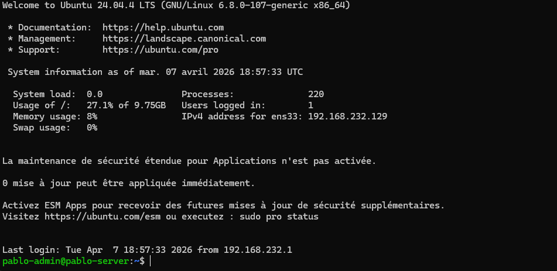
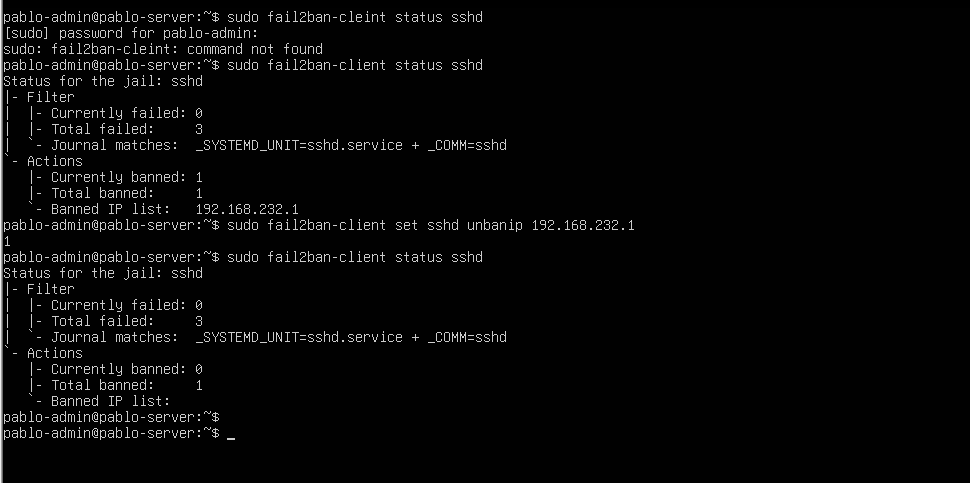
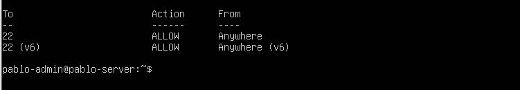

# 🔐 Linux Server Hardening Lab

Dieses Projekt zeigt, wie ein Linux-Server (Ubuntu 24.04) durch grundlegende Sicherheitsmaßnahmen abgesichert werden kann.

Das Ziel ist es, die Angriffsfläche zu reduzieren und den Server vor unbefugtem Zugriff sowie Brute-Force-Angriffen zu schützen.

---

## 📌 Überblick

Dieses Projekt beinhaltet:

* SSH-Authentifizierung mit Schlüssel (kein Passwort-Login)
* Konfiguration der UFW-Firewall
* Schutz durch Fail2Ban gegen Brute-Force-Angriffe

---

## ⚠️ Sicherheitsrisiken

Vor der Absicherung war der Server anfällig für:

* Brute-Force-Angriffe auf SSH
* Unbefugten Zugriff durch Passwort-Login
* Ausnutzung offener Ports

---

## 🛡️ Sicherheitsmaßnahmen

Zur Absicherung wurden folgende Maßnahmen umgesetzt:

* Deaktivierung der Passwort-Authentifizierung → verhindert Brute-Force-Angriffe
* Konfiguration der UFW-Firewall → beschränkt eingehenden Netzwerkverkehr
* Aktivierung von Fail2Ban → blockiert verdächtige IP-Adressen automatisch

---

## 🚀 Verwendete Technologien

* Ubuntu Server 24.04
* OpenSSH
* UFW (Uncomplicated Firewall)
* Fail2Ban

---

## ⚙️ Umsetzung

### 🔑 SSH-Authentifizierung

Der Passwort-Login wurde durch SSH-Schlüssel ersetzt.

* Erstellung eines ed25519-Schlüssels
* Verbindung vom Client (Windows)
* Deaktivierung der Passwort-Authentifizierung in der SSH-Konfiguration

---

### 🔥 UFW Firewall

* Alle eingehenden Verbindungen blockiert
* Ausgehende Verbindungen erlaubt
* Port 22 (SSH) freigegeben

```bash
sudo ufw default deny incoming
sudo ufw default allow outgoing
sudo ufw allow 22
sudo ufw enable
```

---

### 🚫 Fail2Ban Schutz

* Installation und Aktivierung von Fail2Ban
* Schutz für den SSH-Dienst aktiviert
* Automatisches Blockieren verdächtiger IP-Adressen

```bash
sudo apt install fail2ban -y
sudo systemctl enable fail2ban
sudo systemctl start fail2ban
```

---

## 🔍 Vorher vs Nachher

| Bereich     | Vorher ❌    | Nachher ✅   |
| ----------- | ----------- | ----------- |
| SSH Login   | Passwort    | SSH Key     |
| Firewall    | Deaktiviert | Aktiv (UFW) |
| Brute-Force | Möglich     | Blockiert   |

---

## 🔒 Sicherheitsverbesserungen

* Passwort-Login deaktiviert
* Firewall-Regeln aktiviert
* Schutz vor Brute-Force-Angriffen
* Reduzierte Angriffsfläche

---

## 📸 Screenshots

### SSH Login


### Fail2Ban


### UFW Firewall

---

## 📌 Fazit

Dieses Projekt zeigt, wie einfache Maßnahmen die Sicherheit eines Linux-Servers deutlich verbessern können.

Es ist eine praktische Übung für angehende Systemadministratoren oder Fachinformatiker für Systemintegration.

---

## 👤 Autor

* Pablo (Webixly)
* GitHub: [https://github.com/webixly](https://github.com/webixly)
